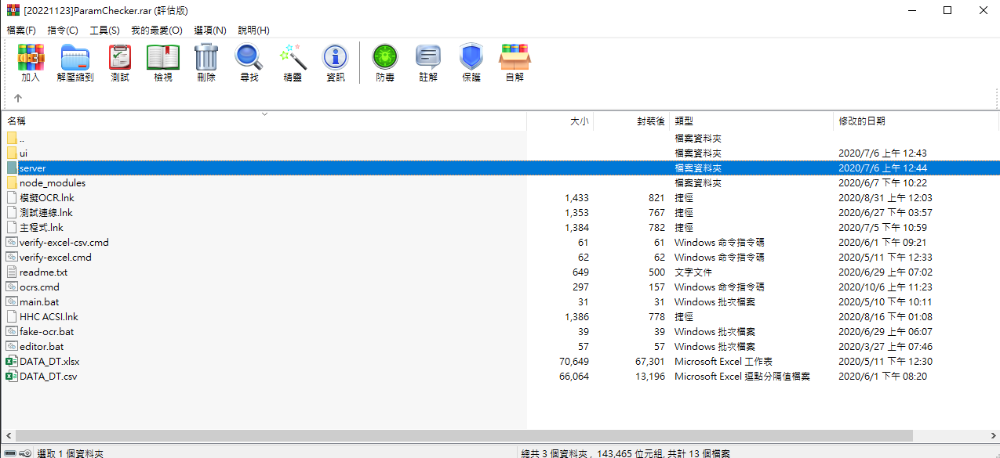
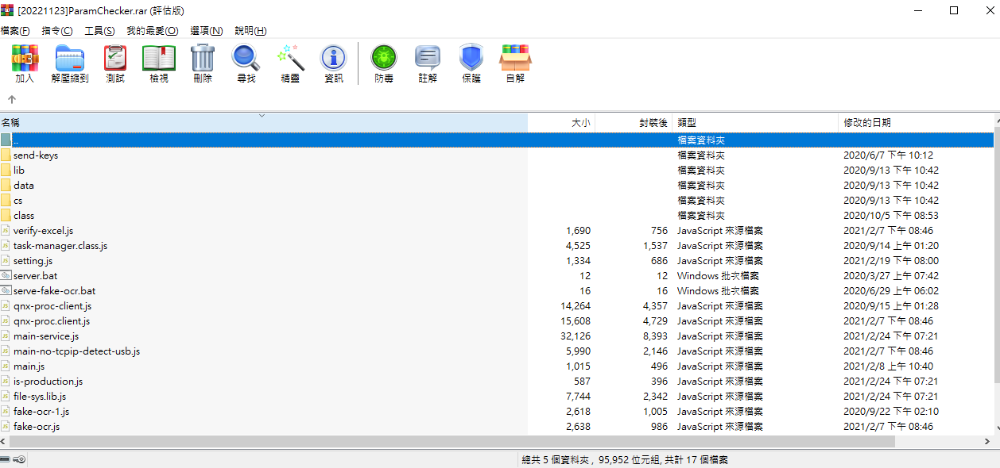
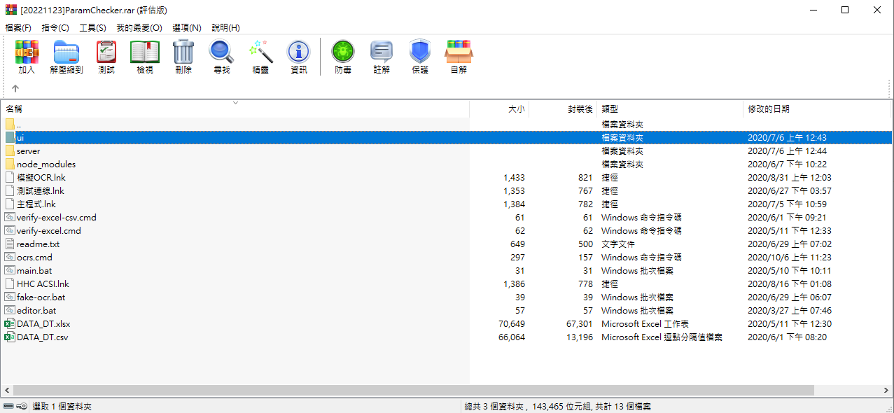
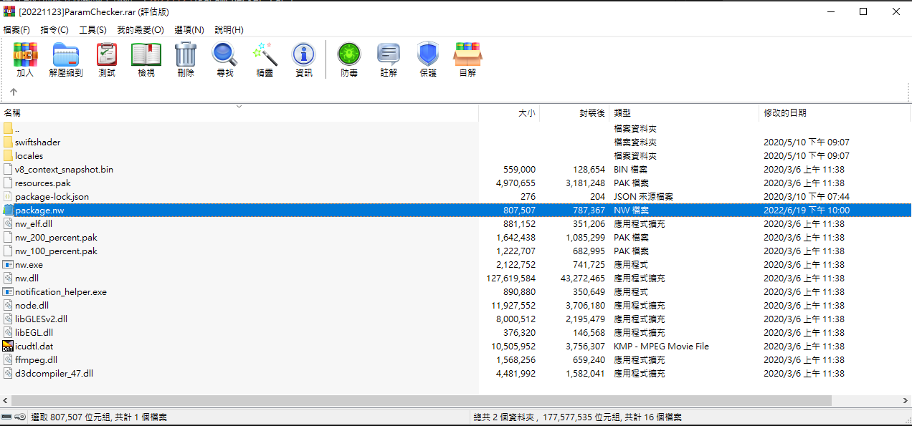
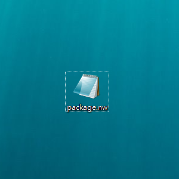
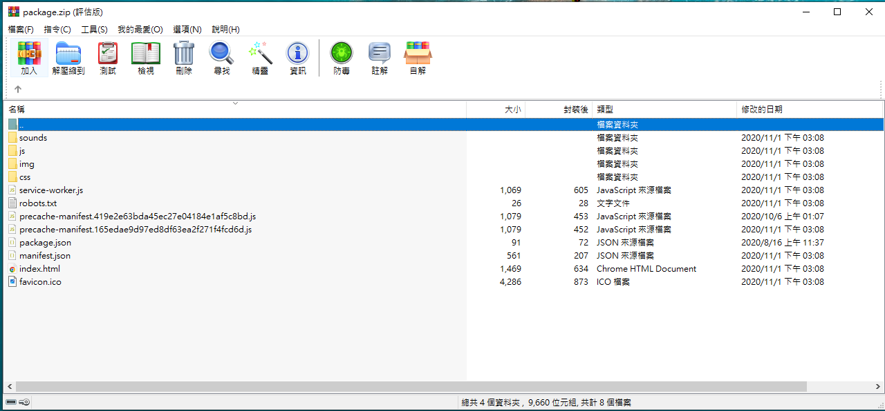

#  專案架構

# 開發環境

##  一般環境配置
- 作業系統
  - Windows，須能執行powershell。
- nodejs
    - 版本：node v16.13.0 (64-bit)
    - 建議使用nvm管理node版本，因為detect-usb使用的nodejs版本會不同。
    - 可嘗試更新至更高，只要開發測試沒遇到問題。
- typescript
    - 版本 v4.5.2
    - 以全域方式安裝：`npm install -g typescript@4.5.2`
    - 目前專案未各別裝，後續可考慮這樣作。
    - 可嘗試更新至更高，只要開發測試沒遇到問題。

建議使用vsc編輯器 + Vetur套件進行開發。 

### detect-usb之開發環境

由於此client程式是為了支援產線設備搭配的Windows XP電腦，所以開發與測試的環境比較不同，需參閱該folder之README。

## 本機測試流程概覽

以下流程已假設相關套件皆已安裝，若無則請先參考各資料夾中的README.md。

1. 至server資料夾首先雙擊build.cmd進行編譯，編譯完成後：
   1. 雙擊dev1.cmd，確定指令中的三個程序都開啟，就完整啟動了伺服器以及相關的配套程序。（目前包含啟動了舊版的detect-usb程序，是否清除待確認）。
   2. 由於此程序會需要世揚的OCR程序開啟，否則進入UI後會持續提示OCR連線錯誤，故也須雙擊ocrs.cmd，開啟模擬的OCR程序。
2. 至vue資料夾執行`npm run serve`，從結果輸出中查看本地網頁hosting位址，至該位址即可查看到UI介面。
3. （optional）detect-usb要測試必須要還原產線環境，故須在前兩步執行後，一樣至detect-usb先雙擊build.cmd進行編譯，再利用nvm動態切換到對應的nodejs環境執行dev.cmd。

# 專案目錄結構

##  資料夾

- vue
    - IT主控的UI
    - 使用vue2，未來建議升級為vue3並且建議使用antdv、primevue等UI庫進行更新。
- server
    - IT主控、同一包code也同時用於QNX主機（QNX.rar）。
    - ts寫的nodejs後端。
- detect-usb
    - 安裝在各機台的client
    - ts寫的nodejs後端。
- autoit
    - Windows的自動化腳本
    - 包含源碼以及編譯好的檔案
    - 由於大多流程都要生產環境才可以測試，所以不會放到上述目錄中進行本地測試，只會放在打包好的rar檔之中。
    - 承前一點，所以本地測試如果進行到有autoit程序的環節，除非本地也在對應位置放置所需的腳本，否則會報錯。
- prodction-package-template
    - 以此專案最新的打包壓縮檔作為範本，後續源碼編譯完成後會以替換檔案的方式更新內容。
- ref
    - 一些雜項檔案，較不重要
- 專案架構
    - 放架構圖

##  檔案

### 設定檔

由於本專案程式啟動時，會將一些重要參數暴露在程序的工作目錄上層（這樣打包後會出現在根目錄），所以server與detect-use這兩個目錄在本地測試時，就會自動產出以下的檔案：

- ip.txt
- ffftp-path.txt
- temperature-setting.txt
- phindows-path.txt

改變這些檔案的內容後重啟程式，配置就會生效。

# 生產環境配置

## IT程式

1. 由於切換網頁流程需要IE，所以要Win7環境運行，且須安裝Node JS 13.14版（14以上不支援Win7）。

## 其他
TODO

# 打包
<<<<<<< HEAD
## ParamChecker.rar 之 IT程序
需完成server與ui之更新，以下詳細說明此二步驟。
### server更新
這段主要是作IT程式的server的代碼更新。
首先複製一個現有已經打包好的程式壓縮檔（例如：[20221123]ParamChecker.rar）
點擊後進入IT/server：

將本repo的/server/build的內容全部複製貼入其中。

壓縮檔中有send-keys資料夾或者一些.bat檔，是預先放置且必須的，由於/server/build底下沒有這些檔案，所以不會被覆蓋。

如果node_modules有更新（安裝新的套件），也需比照處理。

關於send-keys資料夾，當有變更autoit的相關程序要更新，即是在此資料夾作置換。

### ui更新

這段主要是作IT程式的UI的代碼更新。
同上，進入到IT/ui：

將package.nw單獨取出備用

將package.nw的副檔名改為zip，此檔就會變成zip壓縮檔：

打開後便可將/vue/dist中的內容複製到其中，完成後將檔名改回package.nw，並放回原本的壓縮檔中所在的位置，即完成更新。
=======
TODO
>>>>>>> 335d94d8c3aeee6a4caf072f26267b7f3b032d79
